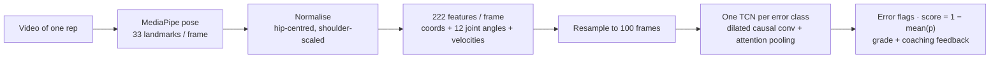

<div align="center">

# Exercise Advisor

**Pose-based action quality assessment for barbell exercises.**
A standard camera in, a form score and specific coaching cues out.

[](https://github.com/evlo-malik/exercise-advisor/actions/workflows/ci.yml)
[](pyproject.toml)
[](https://pytorch.org)
[](https://github.com/astral-sh/ruff)
[](LICENSE)
[](https://exercise-advisor-mu.vercel.app)

[Website](https://exercise-advisor-mu.vercel.app) ·
[Architecture](docs/architecture.md) ·
[Dataset](docs/dataset.md) ·
[Results](docs/results.md) ·
[Research notebook](notebooks/fitness_aqa_pipeline.ipynb)

</div>

---

Poor lifting form causes injuries, and almost nobody trains with a coach watching every
rep. Exercise Advisor extracts a 33-point skeleton from video with MediaPipe, turns it into
a 222-dimensional biomechanical feature sequence, and runs one small temporal convolutional
network per form error to answer two questions about a single repetition:

1. **Which errors happened?** Elbow flare, knee cave, shallow depth, lumbar rounding, ...
2. **How good was the rep?** A score in [0, 1], a letter grade and plain-English feedback.

It supports the three exercises in the [Fitness-AQA](https://arxiv.org/abs/2202.14019)
dataset: **overhead press**, **back squat** and **barbell row**, with seven error
classes in total. The project started as an Imperial College London I-Explore machine
learning project; this repository is the production-quality rewrite of that work, with
the original notebook kept as a record.

```text
$ exercise-advisor predict rep.mp4 --exercise Squat

Exercise : Squat
Source   : rep.mp4
Score    : 0.71  [B]
    knees_inward     p=0.12  (t=0.55)
  ! knees_forward    p=0.63  (t=0.20)
    shallow_depth    p=0.04  (t=0.05)
Feedback :
  - Excessive forward knee travel. Shift the weight towards the heels and push the hips
    back to reduce anterior knee stress.
```

## How it works



| Stage | Key decisions |
|---|---|
| **Pose** | MediaPipe Pose Landmarker (Tasks API); TorchVision Keypoint R-CNN fallback. Missing frames are interpolated. |
| **Features** | Translation and scale invariance via hip centring and shoulder-width scaling; 12 joint angles; first-order velocities; fixed 100-frame resampling normalises tempo. |
| **Data** | Official subject-level splits with an automated leakage check; six landmark-space augmentations; per-class 1:1 balancing by oversampling. |
| **Model** | `ExerciseTCN`: 6 residual blocks of dilated causal 1-D convolutions (receptive field 253 frames) + learned attention pooling. 648k parameters. |
| **Training** | One binary classifier per error, plain BCE, AdamW, early stopping, mixed precision; decision threshold tuned on validation with a precision floor. |
| **Inference** | `AQAPredictor` combines the per-class models into flags, a score, a grade and feedback. |

The full walk-through, including what was tried and abandoned, is in
[docs/architecture.md](docs/architecture.md).

## Results

Test-split metrics for the shipped checkpoints (details and an honest discussion of the
weak spots in [docs/results.md](docs/results.md)):

| Exercise | Error class | F1 | ROC-AUC | Exercise macro F1 |
|---|---|---:|---:|---:|
| Overhead press | knee bend | **0.65** | **0.80** | 0.53 |
| | elbow flare | 0.41 | 0.66 | |
| Back squat | forward knee travel | **0.82** | 0.63 | 0.51 |
| | shallow depth | 0.44 | 0.52 | |
| | knee valgus | 0.29 | 0.62 | |
| Barbell row | lumbar rounding | 0.34 | 0.66 | 0.23 |
| | torso angle | 0.12 | 0.58 | |

Gross, whole-body errors (knee bend during a press, forward knee travel) are detected
well. Subtle depth-direction errors from 2-D landmarks and the single-frame barbell-row
data remain hard; the results page lists the concrete next steps.

## Quick start

```bash
git clone https://github.com/evlo-malik/exercise-advisor.git
cd exercise-advisor
python -m venv .venv && source .venv/bin/activate
pip install -e ".[pose]"          # add [dev] for tests and linting
```

**Score a video** with the shipped checkpoints:

```bash
exercise-advisor predict path/to/rep.mp4 --exercise OHP
exercise-advisor predict path/to/rep.mp4 --exercise Squat --json   # machine-readable
```

**Use it from Python:**

```python
from exercise_advisor import AQAPredictor

predictor = AQAPredictor("OHP", checkpoint_dir="checkpoints")
result = predictor.predict("rep.mp4")
print(result.score, result.grade, result.errors)
print(result.feedback)

# Already have (T, 33, 3) MediaPipe landmarks? Skip video decoding:
result = predictor.predict_landmarks(landmarks)
```

**Train and evaluate** on the Fitness-AQA dataset (request it from the authors, it is not
redistributed here):

```bash
export FITNESS_AQA_ROOT=/path/to/Fitness-AQA_dataset_release

exercise-advisor analyze                  # class balance + dataset figure
exercise-advisor verify-splits            # fails if a subject leaks across splits
exercise-advisor extract --exercise all   # cache landmarks once (slow, GPU helps)
exercise-advisor train --exercise Squat   # one checkpoint per error class
exercise-advisor evaluate --exercise all  # metrics JSON + plots in outputs/
```

Every path can also be set with `--dataset-root`, `--pose-root`, `--checkpoint-dir` and
`--output-dir`.

## Repository layout

```text
exercise-advisor/
├── src/exercise_advisor/     # the package
│   ├── pose/                 #   MediaPipe / TorchVision extractors, landmark conventions
│   ├── features/             #   normalisation, joint angles, velocities, resampling
│   ├── data/                 #   labels, subject-aware splits, augmentation, datasets
│   ├── models/               #   ExerciseTCN + versioned checkpoint I/O
│   ├── training/             #   per-class trainer, threshold sweep, evaluation
│   ├── inference/            #   AQAPredictor, feedback templates, skeleton overlay
│   ├── analysis.py           #   dataset statistics and figures
│   └── cli.py                #   `exercise-advisor` command
├── tests/                    # pytest suite with a synthetic Fitness-AQA fixture
├── checkpoints/              # 7 trained per-class models (+ README)
├── notebooks/                # original research notebook (experiment log)
├── scripts/                  # legacy checkpoint converter
├── docs/                     # architecture, dataset, results
└── web/                      # Next.js project website
```

## Development

```bash
make install        # editable install with dev tools
make check          # ruff + mypy + pytest (what CI runs)
make test-fast      # skip the slow training / checkpoint tests
make web-dev        # run the website locally
```

Tests never touch the real dataset: `tests/conftest.py` generates a small synthetic
Fitness-AQA release, so the whole pipeline (labels, splits, datasets, training,
evaluation, inference) is exercised end-to-end in under a minute on CPU.

See [CONTRIBUTING.md](CONTRIBUTING.md) for conventions and
[CHANGELOG.md](CHANGELOG.md) for release notes.

## Website

`web/` contains the project's Next.js site (deployed at
[exercise-advisor-mu.vercel.app](https://exercise-advisor-mu.vercel.app)) that presents
the motivation, pipeline and architecture for a general audience.

```bash
cd web && npm ci && npm run dev
```

## Acknowledgements

- Dataset: Parmar, Gharat and Rhodin, *Domain Knowledge-Informed Self-Supervised
  Representations for Workout Form Assessment*, arXiv:2202.14019 (2022).
- Pose estimation: [MediaPipe Pose](https://developers.google.com/mediapipe/solutions/vision/pose_landmarker).
- Built as an Imperial College London I-Explore *Demystifying Machine Learning* project.

If you use this code, please cite it via [CITATION.cff](CITATION.cff) and cite the
Fitness-AQA paper.

## License

[MIT](LICENSE). The Fitness-AQA dataset has its own terms and is not part of this
repository.
