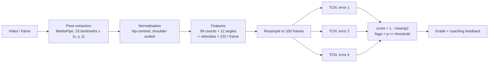

# Architecture

Exercise Advisor turns a short video of a single repetition into a quality score and a
list of specific form errors. This page walks through each stage and the reasons behind
the design choices. The implementation lives in `src/exercise_advisor/`.



## 1. Pose extraction (`pose/`)

`MediaPipePoseExtractor` runs the MediaPipe Pose Landmarker (Tasks API) on every frame and
returns a `(T, 33, 3)` float32 array of normalised image coordinates plus MediaPipe's
pseudo-depth `z`. Frames with no detection are `NaN` and are linearly interpolated later,
so a few dropped frames never break a rep. A `TorchPoseExtractor` fallback maps the 17
COCO keypoints from TorchVision's Keypoint R-CNN into the same 33-slot layout for
environments where MediaPipe's GPU delegate is unavailable.

Landmark indices, left/right pairs and skeleton edges are defined once in
`pose/landmarks.py` and reused by feature engineering, augmentation and visualisation.

## 2. Normalisation and features (`features/`)

Raw coordinates encode *where* someone stands and *how far* the camera is; neither matters
for form. `normalize_pose` subtracts the hip midpoint from every landmark (translation
invariance) and divides by the shoulder width (scale invariance).

Per frame the model then sees:

| Block | Size | Why |
|---|---:|---|
| Normalised coordinates | 33 x 3 = 99 | Full body geometry |
| Joint angles (law of cosines) | 12 | Elbow, shoulder, hip, knee, ankle and wrist angles are what coaches actually look at |
| First-order velocities of the above | 111 | Tempo and dynamics (knee cave happens *during* the ascent) |
| **Total** | **222** | |

Reps have different lengths, so `interpolate_sequence` resamples every rep to a fixed 100
frames. That also normalises tempo: a slow rep and a fast rep of the same movement look
alike.

## 3. Labels and splits (`data/`)

Fitness-AQA ships three label formats (temporal intervals, per-rep binaries and per-frame
binaries). `load_exercise_labels` normalises them into a `RepLabel` with a multi-hot error
vector and a derived quality score in [0, 1] (see [dataset.md](dataset.md)).

The official splits are partitioned by **subject id**. `verify_subject_splits` checks that
no subject appears in more than one split; the CLI command `verify-splits` fails if it
finds leakage. `build_subject_split` creates a fresh subject-level split for new data.

## 4. Datasets and augmentation

`PoseDataset` reads cached landmark files and builds features on the fly, so the same
raw landmarks can be augmented differently on every epoch. `augment_landmarks` applies
six landmark-space augmentations (temporal jitter, Gaussian noise, horizontal flip with
left/right swap, scale jitter, camera-yaw rotation and landmark dropout).

`BinaryPoseDataset` is the training set for **one** error class. It oversamples the
minority class by index repetition until the classes are 1:1. Combined with augmentation,
each repeat of a rep is a different sample.

## 5. Model (`models/tcn.py`)

`ExerciseTCN` is a temporal convolutional network:

1. Linear projection of the 222 features to 128 channels.
2. Six residual blocks of dilated **causal** 1-D convolutions (dilations 1 to 32,
   kernel 3, BatchNorm, dropout 0.3). The receptive field is 253 frames, so the last
   block sees the whole rep.
3. `AttentionPool`: a learned soft attention over time replaces global average pooling
   so the model can focus on the frames where an error is visible. The attention weights
   are exposed through `ExerciseTCN.attention` for interpretability.
4. A two-layer classification head producing one logit.

The shipped configuration has 647,938 trainable parameters.

**Why a TCN rather than an LSTM or Transformer?** Reps are short (100 frames), the
dataset is small (a few thousand reps), and convolutions train quickly, parallelise fully
on GPU and have a well-understood receptive field. Dilated causal convolutions give
multi-scale temporal context without the optimisation headaches of recurrent models.

## 6. Training (`training/trainer.py`)

An earlier version trained one multi-label model per exercise with a dual regression +
classification head, focal loss, `pos_weight` and a weighted sampler. The imbalance
corrections interacted badly and the regression head dominated the loss. The final
approach is deliberately simpler:

- **One binary classifier per error class**, trained on a balanced dataset with plain
  `BCEWithLogitsLoss`.
- AdamW (`lr=3e-4`, `weight_decay=5e-4`), `ReduceLROnPlateau`, gradient clipping at 1.0,
  mixed precision on CUDA, early stopping with patience 30 on validation loss.
- After training, `sweep_threshold` picks the decision threshold that maximises F1 on
  the validation split subject to a precision floor of 0.20. Thresholds are stored in
  the checkpoint and used at inference.

## 7. Evaluation (`training/evaluation.py`)

`predict_multilabel` runs every per-class model over a split and stacks the outputs into
`(N, C)` probability and label matrices. `EvaluationResult` reports per-class precision,
recall, F1 and ROC-AUC, macro F1, and Spearman correlation and MAE between the ground-truth
score and the derived score `1 - mean(p)`.

## 8. Inference (`inference/predictor.py`)

`AQAPredictor` loads the checkpoints for one exercise and exposes:

```python
predictor = AQAPredictor("Squat", checkpoint_dir="checkpoints")
result = predictor.predict("rep.mp4")          # runs MediaPipe
result = predictor.predict_landmarks(array)    # if you already have (T, 33, 3) landmarks
```

The result carries per-error probabilities and thresholds, the flagged errors, a score,
a letter grade and coaching feedback from `inference/feedback.py`. The extractor is
injectable, which is how the test suite exercises the predictor without MediaPipe.

## Checkpoint format

Checkpoints are plain dictionaries (tensors, numbers, strings, lists) and load with
`torch.load(..., weights_only=True)`. The layout is documented in
`models/checkpoint.py` and versioned with `CHECKPOINT_FORMAT_VERSION`.
