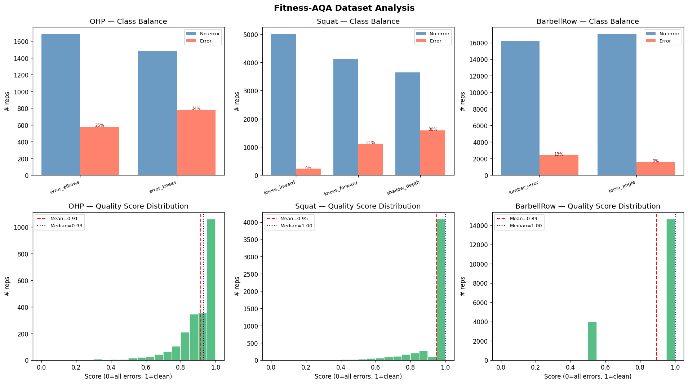

# Dataset: Fitness-AQA

The models are trained on the **Fitness-AQA** dataset released with
[Parmar, Gharat and Rhodin, *Domain Knowledge-Informed Self-Supervised Representations for
Workout Form Assessment* (2022)](https://arxiv.org/abs/2202.14019). It contains video
clips and frames of real people performing three barbell exercises, annotated with the
form errors a coach would flag.

> The dataset is **not** included in this repository. It shows identifiable people and is
> distributed by the authors for research use. Request it from the authors, then point
> `FITNESS_AQA_ROOT` at the unpacked release.

## Exercises and error classes

| Exercise | Error class | Label format | Meaning |
|---|---|---|---|
| Overhead press (OHP) | `error_elbows` | interval | Elbows flare out during the press |
| | `error_knees` | interval | Knees bend / leg drive during the press |
| Back squat | `knees_inward` | interval | Knee valgus (knees cave in) |
| | `knees_forward` | interval | Excessive forward knee travel |
| | `shallow_depth` | frame binary | Rep does not reach depth |
| Barbell row | `lumbar_error` | binary | Lumbar spine rounds under load |
| | `torso_angle` | binary | Torso too upright |

Label formats:

- **interval**: `[[t_start, t_end], ...]` in seconds within the clip. An empty list means
  the rep is clean for that error.
- **binary**: `0` / `1` for the whole rep.
- **frame binary**: `0` / `1` per frame with `{subject}_{rep}_{frame}` keys. The loader
  aggregates to rep level: if any frame is flagged the rep is flagged.

## Keys and splits

OHP and Squat clips are keyed `{subject}_{rep}` (for example `46777_3`); BarbellRow frames
are keyed `{subject}_{session}_{rep}` (for example `56067_3_51`). The subject id is always
the first token, which is what the subject-aware split check relies on.

The release ships official train / val / test splits per exercise, partitioned by
subject. BarbellRow has separate splits per error; the lumbar split covers every labelled
rep and is used as the primary split.

Test split sizes used for the reported results:

| Exercise | Test reps |
|---|---:|
| OHP | 339 |
| Squat | 243 |
| BarbellRow | 2,191 |

## Quality score

The dataset has no rep-level quality score, so one is derived from the labels:

- Interval errors: `score = 1 - clamp(total error seconds / clip duration, 0, 1)` with an
  8 second nominal clip duration.
- Binary errors on an interval exercise (Squat `shallow_depth`) multiply the score by
  `1 - 0.5 * (binary errors / binary classes)`.
- All-binary exercises (BarbellRow): `score = 1 - mean(multi-hot)`.

At inference the score is instead `1 - mean(error probabilities)`, and the Spearman
correlation between the two is one of the reported metrics.

## Class balance

Every error class is imbalanced, in some cases heavily. The figure below (generated by
`exercise-advisor analyze`) shows positive vs. negative counts per class and the
distribution of derived scores.



This imbalance is why the final approach trains one binary classifier per error on a
balanced, augmented dataset instead of a single multi-label model with loss re-weighting.

## Media types

OHP and Squat reps are `.mp4` clips, so their landmark sequences are genuinely temporal.
**BarbellRow reps are single `.jpg` frames.** Their pose files have shape `(1, 33, 3)`,
are repeated to 100 frames and therefore carry zero velocity information. This is the
main reason BarbellRow scores poorly (see [results.md](results.md)).

## Preparing the data

```bash
export FITNESS_AQA_ROOT=/path/to/Fitness-AQA_dataset_release
export EXERCISE_ADVISOR_POSES=data/poses

exercise-advisor analyze                 # sanity-check labels, plot class balance
exercise-advisor verify-splits           # confirm no subject leakage
exercise-advisor extract --exercise all  # cache (T, 33, 3) landmarks with MediaPipe
```

Extraction is the slow step (MediaPipe on every frame of every clip). Cached landmarks
are small, and everything downstream reads only those `.npy` files.
